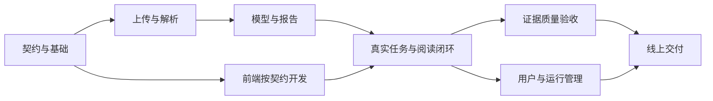

# Paper Reader 详细开发计划

更新日期：2026-09-18  
状态：开发计划，以下未勾选任务尚未实现。  
适用目录：`paper-reader/`  
最终网站：<https://windviolett.github.io/paper-reader/>

## 1. 目标和当前基线

目标是让具有计算机基础的读者上传 AI 论文 PDF，获得中文的“速览＋精读”报告，按照研究问题、贡献、方法、实验、局限的顺序阅读，并能核对原文来源。

本计划将 [产品规范](product-spec.md) 拆成可以分配、实现和验收的任务；[报告样稿](sample-report.md) 负责说明内容结构，[部署说明](deployment.md) 负责上线操作。样稿中的虚构事实不能进入真实论文报告。

### 已完成并实际存在

- [x] 静态阅读原型：目录、速览／精读、可折叠说明、示例证据卡。
- [x] 示例报告 Markdown 下载和浏览器打印功能代码。
- [x] GitHub 仓库及 Pages 发布工作流；原型已上线。
- [x] 产品规范、样稿和初版部署说明。

“代码存在”不等于完整验收通过：浏览器交互、移动端和打印仍需在后续阶段验证。

### 尚未实现

PDF 上传和解析、真实模型调用、动态报告、原 PDF 预览与来源定位、后台任务、数据持久化、用户隔离、报告编辑、PR 自动检查和真实论文质量评估。

当前 `index.html` 同时包含页面、样式、行为与固定样稿，`docs/sample-report.md` 与内嵌样稿存在重复维护。现有工作流只发布列出的静态文件，不运行 PR 检查。

## 2. 首版范围和阶段边界

### 首版必须支持

- 单次上传一篇文字可提取的中英文 AI 方法论文，输出中文解读并保留关键英文术语。
- 初始产品限制暂设 20 MB、50 页，包括附录页；接入所选模型后，以实际可支持的更严格限制为准。
- 识别研究方向标签和论文类型。只对方法论文提供完整模板；其他类型提示支持范围，不套造实验字段。
- 报告包含概览、问题、贡献、方法、实验、局限、复现线索和必要的术语解释。
- 主要原文事实带来源页码；原文没有的信息明确标记，不补造数字、公式、作者、发表信息和链接。
- 支持处理状态、失败说明、历史报告、编辑版本、Markdown 导出及打印 PDF。
- 从现有 GitHub Pages 网址进入，调用独立部署的后端；对外开放付费模型调用前具备访问控制和用量限制。

### 后续扩展

扫描论文 OCR、复杂图表的高质量视觉解析、理论／综述／数据集专用模板、批量上传、Word 导出、跨论文问答、论文推荐和外部文献查新。首版对扫描或无法解析的页面明确标注，不静默忽略。

### 两个验收节点

| 节点 | 必须能够演示的结果 | 使用范围 |
| --- | --- | --- |
| A：真实论文可用演示 | 上传文字 PDF → 后端提取 → 真实 LLM 报告 → 查看 PDF 来源 → 导出 | 本地或受控测试环境；尚未完成身份隔离时，不公开模型调用入口 |
| B：首版完整交付 | 在 A 的基础上，具备来源质量验收、用户与文件隔离、历史／版本、失败恢复、用量限制和线上部署 | 小规模邀请用户使用；达到全部发布门槛后再扩大范围 |

## 3. 设计约定

以下为本次计划采用的默认方案；供应商、SDK 和解析工具的具体版本在实现前核对官方文档并锁定。

| 部分 | 默认方案 | 原因和限制 |
| --- | --- | --- |
| 前端 | 保留现有静态网页，逐步拆成 CSS、JavaScript 模块和报告组件 | 复用现有阅读体验；第一阶段不要求迁移 React 或 Next.js |
| 前端发布 | GitHub Pages，所有路径兼容 `/paper-reader/` | 使用 hash 路由处理任务和报告入口，避免刷新后找不到页面 |
| 后端 | Python + FastAPI，独立 HTTPS 服务 | 集中处理上传、任务、模型调用和访问校验 |
| PDF 处理 | 先验证按页提取文本的路线，保留物理页序；必要时评估局部视觉输入 | 工具选择依据真实样本；不能以提取到文字代表完整理解图表 |
| 数据 | API／Worker 共用数据库；先用本地 SQLite 验证，线上目标 PostgreSQL | 提供迁移脚本；SQLite 限单机小规模开发使用 |
| 文件 | 本地开发目录，线上私有对象存储 | 上传文件不进入公开仓库或 Pages 产物 |
| 后台任务 | 独立 Worker，第一版使用持久化任务表轮询与领取机制 | 任务不依赖浏览器连接；先单 Worker，扩并发前验证原子领取和租约机制 |
| LLM | 一个供应商、一套可配置模型；封装统一接口 | 首版不做多供应商自动切换；限制调用次数、超时和费用 |
| 报告 | 以带版本的结构化 JSON 为唯一事实来源 | 网页、Markdown 与打印视图读取同一版本；不维护多份正文 |
| 认证 | 线上优先选成熟托管身份服务，服务端验证用户身份 | 具体服务在上线前选定；首版本地验证阶段不自建密码系统 |

拟定目录如下；这是目标结构，不代表这些文件当前已经存在：

```text
paper-reader/
├── index.html
├── assets/
│   ├── styles.css
│   └── js/
│       ├── app.js
│       ├── api.js
│       ├── upload.js
│       ├── report.js
│       └── pdf-viewer.js
├── public-config.example.json       # 仅非敏感配置，如后端地址
├── contracts/
│   ├── report.schema.json
│   ├── job.schema.json
│   └── examples/                    # 明确标注的合成样例
├── backend/
│   ├── app/
│   │   ├── main.py
│   │   ├── api/
│   │   ├── models/
│   │   ├── services/
│   │   ├── prompts/
│   │   └── worker.py
│   ├── migrations/
│   ├── tests/
│   ├── pyproject.toml
│   └── .env.example                 # 变量名和空值，不含真实凭据
├── tests/browser/
├── evaluation/                     # 标注规则、评测脚本、结果
├── docs/
└── .github/workflows/
    ├── checks.yml                   # PR 检查
    └── pages.yml                    # main 的前端部署
```

## 4. 接口、报告和任务状态先达成一致

### 4.1 接口草案

P0-02 实现并冻结第一版契约后，前端可使用合成响应独立开发。后端挂在独立域名下，以下路径均相对于后端地址。

| 接口 | 输入／输出 | 验证重点 |
| --- | --- | --- |
| `GET /health` | 返回服务健康状态，不泄露环境变量 | 用于运行检查，不等于模型可调用 |
| `POST /api/documents` | 接收 PDF；返回 `document_id`、页数和读取提示 | 文件实际格式、限制、归属；此步不调用付费模型 |
| `POST /api/jobs` | 输入 `document_id`、模板版本；返回 `202` 和 `job_id` | 支持幂等键；重复点击不重复付费处理 |
| `GET /api/jobs/{id}` | 返回 `status`、`stage`、错误及完成后的 `report_id` | 刷新可恢复；只允许所属用户访问 |
| `POST /api/jobs/{id}/retry` | 对允许重试的失败任务创建关联的新尝试 | 保留旧尝试、累计用量；不把每次重试当作新额度 |
| `GET /api/reports` | 分页返回当前用户历史报告 | 不返回其他用户结果 |
| `GET /api/reports/{id}` | 返回结构化报告、修订号和来源映射 | 缺失信息和处理范围完整保留 |
| `PATCH /api/reports/{id}` | 提交编辑内容和原修订号；返回新版本 | 过期修订号返回冲突，不覆盖其他修改；保留原始生成版本 |
| `GET /api/documents/{id}/file` | 授权后返回 PDF 或短期有效下载地址 | 原文预览、过期地址和越权请求 |
| `GET /api/reports/{id}/export?format=markdown&revision=...` | 下载指定报告版本 | 与阅读、编辑视图一致 |
| `DELETE /api/documents/{id}` | 删除／停用文档及关联结果，返回明确状态 | 处理中删除不能在任务结束时重新写回已删除内容 |

错误响应统一包含 `code`、可读 `message`、`retryable` 和 `request_id`。配额不足、文件无法解析与供应商暂时失败应使用不同错误码。

### 4.2 报告契约

最少包含 `schema_version`、`report_id`、`revision`、论文元信息、方向标签、论文类型、处理覆盖范围、概览、阅读模块、实验结果、证据列表、问题提示和用量元数据。

事实记录区分 `paper_statement`、`explanation`、`inference`、`derived_calculation`。每个关键原文事实引用 `evidence_ids`；证据含文档 ID、PDF 实际页序、摘录，以及可选的图表／公式编号和真实坐标。计算结果记录公式与输入事实 ID。

缺失值使用 `null`，状态区分 `not_reported`、`not_applicable`、`unreadable`、`not_processed`、`conflicting`。只有相关范围已经检查后，才允许标记“原文未报告”。

### 4.3 任务状态

```text
queued → running → succeeded
             ├──→ partial
             └──→ failed
```

`running` 内的 `stage` 可为 `parsing / extracting / generating / validating`。网页展示真实阶段，不编造百分比。技术处理状态与内容核对状态分开：`succeeded` 仅表示处理完成，不代表人工确认事实正确。

Worker 使用心跳、租约和超时回收处理异常退出；任务结果保存必须校验任务归属、尝试号和文档是否已删除。重复任务可在同一用户内按文件哈希＋模板／模型版本识别，不能向其他用户暴露文件是否存在。

## 5. 里程碑与工期估算

工作量单位为“人日”，是首次估算，不是交付承诺。默认开发者熟悉所选技术且能投入完整工作日；首次学习、模型接入、部署账号和样本准备会影响进度。

| 阶段 | 产物 | 前置依赖 | 估算 |
| --- | --- | --- | --- |
| P0 基础与契约 | 可维护前端、Schema、接口约定、检查入口 | 当前原型 | 2–3 人日 |
| P1 上传与解析 | PDF 上传、按页文本、读取覆盖结果 | P0 契约 | 3–5 人日 |
| P2 模型与报告 | 一篇真实论文的结构化分析 | P1 输出、模型凭据 | 4–7 人日 |
| P3 任务与阅读闭环 | 持久任务、动态页面、原文定位、导出 | P0–P2；前端可先按契约开发 | 4–6 人日 |
| P4 证据与内容质量 | 核对规则、图表／公式降级、评测记录 | 真实闭环及样本 | 3–5 人日 |
| P5 多用户与运行管理 | 身份、隔离、私有存储、配额、编辑历史 | P3 数据与任务结构 | 4–7 人日 |
| P6 部署与交付 | 线上联调、异常验证、交付文档 | P4、P5 验收 | 2–4 人日 |

合计约 22–37 人日。多人可并行部分工作，但不是直接除以人数得到工期。P0–P3 对应节点 A，P4–P6 完成后才进入节点 B。

主要依赖：



## 6. 详细任务清单

角色：前端、后端、论文处理、质量／发布；同一人可以兼任。任务勾选表示该任务的验收已完成，不以“写完代码”或“合并 PR”单独作为依据。

### P0：建立可维护的项目基础

- [ ] **P0-01 · 确定样本与范围**（论文处理；无依赖）  
  选取 3–5 篇可使用的真实 AI 方法论文，记录来源、版本、哈希、语言、页数和许可；包含普通文字、表格密集和带附录样本。准备至少一份不支持类型用于验证提示。真实全文默认保存在本地或私有存储，不因评测而自动公开上传仓库。验收：样本清单可复现，人工写出每篇的核心问题和主要实验事实。
- [ ] **P0-02 · 报告和接口契约**（后端＋前端；依赖 P0-01 的首份标注）  
  落地第 4 节为版本化 JSON Schema、接口说明和合成响应。验收：成功、缺失字段、读取不完整、失败四类响应可验证；前后端对字段含义一致。
- [ ] **P0-03 · 拆分前端与样例数据**（前端；依赖 P0-02）  
  提取 CSS、业务模块和示例数据；标题、标签、正文、证据、导出从同一报告对象生成。验收：更新一处样例数据即可同步页面和导出，原有阅读交互保留。前端开始通过本地 HTTP 服务预览，README 写明启动方式。
- [ ] **P0-04 · 后端开发骨架**（后端；依赖 P0-02）  
  建立依赖与版本锁定、配置加载、健康检查、日志、开发环境说明和不含凭据的 `.env.example`。验收：新环境按文档启动，缺少模型凭据时明确提示，不返回模拟成功。
- [ ] **P0-05 · 检查与发布结构**（质量／发布；依赖 P0-03、P0-04）  
  新增 PR 检查工作流，校验契约和关键路径；更新 Pages 构建清单及路径触发规则，包含新静态资源。验收：PR 执行检查且不部署正式网站，`main` 的前端变更能完整发布，前端产物不含后端或私有文件。

阶段出口：开发环境可启动，接口与报告数据格式冻结为 v1，前后端能够分别开发。

### P1：上传 PDF 并获得可追溯内容

- [ ] **P1-01 · 文档存储与上传接口**（后端；依赖 P0-04）  
  创建文档表和存储接口，验证实际文件格式、文件大小、页数、加密及损坏情况；使用内部 ID 存文件，不用用户文件名拼接路径。验收：合法文件可读取；超限、伪装文件和加密文件均有明确错误，均未调用模型。
- [ ] **P1-02 · 按页解析与覆盖登记**（论文处理；依赖 P1-01）  
  比较候选解析器在双栏、连字符、页眉页脚、表格上的结果，保留物理页序与正文／附录／参考文献边界。验收：逐页有解析状态，人工抽查顺序和关键内容；跨页段落仍能关联来源。
- [ ] **P1-03 · 不支持页面的处理**（论文处理；依赖 P1-02）  
  识别扫描、空白或解析质量不足的页，保留原文件以便查看。验收：出现无法读取的重要页面时返回部分覆盖或不支持状态，不宣称完整阅读；不把失败记成“论文未报告”。
- [ ] **P1-04 · 上传界面**（前端；依赖 P0-02，可与 P1-01 并行）  
  实现选择／拖拽、文件信息、前端初步检查、上传状态和错误反馈。验收：前端限制与服务端一致，上传失败可重新选择，不出现重复提交按钮误触导致的多个任务。

阶段出口：真实 PDF 可以上传，后端能返回页数、解析文本和明确的读取范围。

### P2：模型分析与结构化报告

- [ ] **P2-01 · 接入一个真实模型**（论文处理；依赖 P0-04、供应商凭据）  
  核对供应商的文件输入、结构化输出、上下文限制、定价和 SDK，选定一个模型并配置服务端凭据。实现统一调用接口、超时、错误映射和用量记录。验收：可执行真实小样本请求，记录模型标识与调用用量，日志不输出 Key。
- [ ] **P2-02 · 分类和模板选择**（论文处理；依赖 P1-02、P2-01）  
  生成研究方向标签和论文类型，类型不明确时允许待确认。验收：方法论文进入对应模板，综述／理论样本不会被硬填为实验方法论文。
- [ ] **P2-03 · 分段事实提取**（论文处理；依赖 P2-02、P0-02）  
  按章节或页组抽取事实、实验行和证据；为各块分配输入／输出预算，汇总去重并保留冲突。验收：来源仍对应原 PDF 页序，附录范围明确，引用文献的结果不误算成本文结果。
- [ ] **P2-04 · 生成阅读报告**（论文处理；依赖 P2-03）  
  基于已提取事实生成概览、方法解释、实验分析和局限；统一术语、控制重复，保留系统解释标记。验收：报告满足 Schema，缺失值有状态，各模块实际内容不同且符合阅读顺序。
- [ ] **P2-05 · 内容校验和调用边界**（后端＋论文处理；依赖 P2-04）  
  校验必需字段、证据 ID、页码范围、数值单位、实验条件；对解析失败或格式错误只做有限次修复。PDF 中的文字作为数据处理，不接受其改变系统规则或触发外部操作的指令。验收：无效输出被标记或拒绝；重试有上限，截断结果不标记完整成功，测试夹具不能替代真实模型验收。

阶段出口：至少一篇真实论文生成可阅读的结构化 JSON，保留证据与用量记录。

### P3：串起任务、阅读、原文和导出

- [ ] **P3-01 · 持久化任务与 Worker**（后端；依赖 P1-01、P2 的分析入口）  
  实现任务表、领取、状态迁移、心跳、阶段结果和有限重试；浏览器断开后任务继续执行。验收：重复请求只产生一个有效任务；进程重启后任务能恢复或明确失败，不永久卡在处理中。
- [ ] **P3-02 · 前端任务状态**（前端；依赖 P0-02、P3-01 联调）  
  以合理间隔轮询状态，任务结束停止轮询；URL 保存任务／报告 ID。验收：刷新恢复、限流和后端不可达均有提示，不将未知状态显示为成功。
- [ ] **P3-03 · 动态阅读页面**（前端；依赖 P0-03、P2-04）  
  元信息、方向、正文、实验表格和来源均由真实响应渲染；缺失、部分覆盖和需核对状态可见。验收：连续处理两篇论文显示各自内容，没有残留上一份报告的标题或示例事实。
- [ ] **P3-04 · PDF 预览与页码跳转**（前端＋后端；依赖 P1-01、P2-03）  
  选择并验证 PDF 阅读组件；引用按钮打开原文件对应物理页序。验收：电脑和手机可核对来源；没有坐标时仅定位页，不制造精确高亮；文件访问失败不伪装成空白页。
- [ ] **P3-05 · 同源导出与首次联调**（前端＋后端；依赖 P3-03、P3-04）  
  由同一报告对象导出 Markdown 并提供打印视图，包含引用和读取范围。验收：P0 样本跑通上传到导出；关键数值与网页一致，打印不会漏掉折叠模块。

阶段出口：达到节点 A；保存 3–5 篇样本的处理结果、耗时、费用和已知问题。

### P4：核对证据并提高阅读质量

- [ ] **P4-01 · 来源支持检查**（论文处理；依赖 P3）  
  校验摘录是否存在、页码是否匹配；文字匹配、数值核对与人工语义核对分别记录。验收：能区分“来源存在”和“来源支持结论”，引用不能只靠模型填一个页码。
- [ ] **P4-02 · 实验事实检查**（论文处理＋质量；依赖 P2-03）  
  保存数据集／划分、方法、指标、方向、单位、数值和设置；系统计算保存算式与输入。验收：百分点与百分比正确，不跨不同配置直接比较，未报告的方差或显著性不补造。
- [ ] **P4-03 · 公式与图表降级**（前端＋论文处理；依赖 P3-04）  
  关键图表可定位原页，公式可以显示已可靠解析的表达式和释义；无法可靠识别时展示原文位置及限制。验收：不因首版视觉能力不足而生成猜测图表数据，特殊字符与公式展示不破坏页面。
- [ ] **P4-04 · 建立独立验收集**（质量；依赖 P0-01、P3）  
  扩展到 20–30 篇代表性样本，明确调试集和独立验收集；冻结验收集，记录人工事实清单及核对来源。验收：每篇可追溯版本与哈希，提示词调整后重跑相关失败用例，不只展示成功样例。
- [ ] **P4-05 · 阅读质量评估**（质量；依赖 P4-04）  
  至少两位有计算机基础的读者回答研究问题、方法、结果和边界四类问题，记录误解与遗漏。验收：生成评测记录，按第 8 节门槛决定是否进入发布阶段。

阶段出口：质量问题分类清楚，关键事实可核对，完成独立样本评测而非仅验证 JSON 格式。

### P5：支持用户、历史和受控运行

- [ ] **P5-01 · 身份与访问隔离**（后端；依赖 P3、身份服务配置）  
  服务端验证用户身份；上传时绑定所有者，文档／任务／报告／原文／导出均校验归属。验收：两个账号互相访问对方 ID 均被拒绝；不能信任浏览器传来的 `owner_id`。本地开发身份模式不能在公开部署启用。
- [ ] **P5-02 · 线上存储与数据库迁移**（后端；依赖 P5-01、托管配置）  
  接入 PostgreSQL 和私有文件存储，提供数据库迁移、备份和恢复步骤；配置 PDF 预览的访问有效期。验收：重启后文档和结果仍在，可在测试环境完成一次恢复，不依赖临时容器磁盘。
- [ ] **P5-03 · 历史和报告修订**（前端＋后端；依赖 P5-01、P3-03）  
  列出当前用户报告，支持编辑保存新版本并保留原始生成内容；并发编辑通过修订号检测。验收：重新登录后仍能找到报告，旧版本可追溯，修改事实后的核对状态不会自动变成已验证。
- [ ] **P5-04 · 配额与成本控制**（后端；依赖 P2-01、P3-01、P5-01）  
  设置用户频率、文件数量、同时运行任务数、每任务 Token／调用预算和有限重试；记录估算与供应商报告用量的区别。验收：超过额度时在调用前拒绝；并发创建不会绕过额度；重试计入原任务总预算。
- [ ] **P5-05 · 删除与保留周期**（后端＋前端；依赖 P5-02）  
  用户可删除论文和关联报告，配置文件保留周期；处理中删除应阻止后续写回并清理供应商侧可管理的文件。验收：删除后常规访问和新签名下载地址不可用，记录已有短期地址的有效期边界及不可立即撤销的限制。

阶段出口：可让少量被邀请用户试用，具备访问隔离、存储持久性和明确费用边界。

### P6：完成线上交付

- [ ] **P6-01 · 后端与前端部署联调**（质量／发布＋后端；依赖 P4、P5）  
  部署 API 和 Worker，配置数据库、存储、身份及模型凭据；前端设置公开 HTTPS API 地址。验收：从现有 Pages 项目网址走通真实流程，CORS origin 使用 `https://windviolett.github.io`，并独立验证用户权限。
- [ ] **P6-02 · 故障与浏览器验收**（质量；依赖 P6-01）  
  验证桌面与手机阅读、路径刷新、长表格、打印和原文定位；模拟限流、超时、Worker 重启和解析错误。验收：失败可解释、重试有限、历史不会损坏，浏览器控制台无影响核心流程的错误。
- [ ] **P6-03 · 发布和恢复演练**（质量／发布；依赖 P6-01）  
  锁定前后端版本及 Schema 兼容范围；演练静态前端回退、后端版本恢复和数据迁移兼容。验收：生产配置不靠手工修改源码，恢复步骤可重复，部署日志不暴露用户全文或凭据。
- [ ] **P6-04 · 文档与交付验收**（维护者＋质量；依赖 P6-02、P6-03）  
  更新 README、使用指南、配置说明、部署说明、已知限制和费用样本；关联通过的评测记录。验收：新开发者能按文档运行，用户能完成真实论文阅读；交付清单全部有证据。

## 7. 多人分工与 Git 协作

### 建议分工

| 角色 | 主要负责 | 需要提前协调 |
| --- | --- | --- |
| 前端 | P0-03、P1-04、P3 页面、P5-03 页面 | 与后端一起确定 P0-02，不自创返回字段 |
| 后端 | P0-04、P1-01、P3-01、P5 | 与论文处理约定任务入口、证据结构和失败状态 |
| 论文处理 | P0-01、P1 解析、P2、P4 的事实检查 | 与质量人员共用样本、记录模板／模型版本 |
| 质量／发布 | P0-05、P4 评估、P6 | PR 检查与正式发布分开；有人独立核对论文事实 |

两人团队可由一人负责前端和发布，另一人负责后端和论文处理；双方交叉评审。分工按能力调整，模块边界不等于不能共同讨论。

### 每个任务的完成方式

1. 选择一个任务 ID，记录负责人、范围和验收条件。
2. 从已同步的 `main` 新建任务分支；示例：`refactor/frontend-modules`、`feature/pdf-upload`、`feature/paper-analysis`、`feature/report-view`。
3. 提交围绕一个可验证目标的 PR。说明关联任务、行为变化、验证结果及接口兼容影响。
4. 由另一位成员评审，自动检查通过后合并。较大的改动先拆小 PR，避免整个模块长时间不合并。
5. 合并后更新本计划任务状态并链接 PR／验收记录；新功能涉及前端时检查 Pages 发布结果。

建议保护 `main`，要求 PR 和至少一位其他成员批准；有新增提交时重新评审，并让管理员遵守同样的要求。是否已配置分支保护需实际检查，本计划不宣称规则已生效。PR 检查实现并成功运行后，再设置为必需检查；不能把仅在合并后运行的部署任务设成 PR 合并的前置门槛。

## 8. 验证矩阵与发布门槛

| 验证对象 | 检查方式 | 通过标准 |
| --- | --- | --- |
| 上传与解析 | 合法、损坏、加密、扫描、超限样本 | 合法样本可处理，异常明确，覆盖状态真实 |
| Schema | 成功、缺失、部分、无效输出夹具 | 字段可验证，未知／不支持情况有明确状态 |
| 原文定位 | 对照人工事实和真实 PDF | 每个关键引用定位正确，且来源支持其表述 |
| 主要实验数字 | 核对值、单位、条件、增减方向和计算 | 独立验收集里报告呈现的主要数字全部正确；错误修复前不计通过 |
| 覆盖 | 人工关键事实清单与报告逐项比较 | 关键事实召回率目标 ≥90%；不能通过少输出数字掩盖遗漏 |
| 分类 | 独立集人工标注，单独记录待确认 | 目标准确率 ≥90%，按类型报告样本数；待确认计入总量并另报占比 |
| 用户隔离 | 两账号访问文档、任务、报告与导出 | 所有越权路径被拒绝 |
| 后台恢复 | 断网、重复点击、Worker 中断和重试 | 不假成功、不无限重试、无重复有效报告；额外调用可追踪并受预算限制 |
| 编辑与导出 | 同一修订号对比网页、Markdown、打印 | 内容、数值、来源、缺失提示一致，并发编辑不会静默覆盖 |
| 页面兼容 | 桌面和手机实际浏览器验证 | 目录、阅读切换、原文、错误提示、下载和打印可用 |
| 发布 | PR 检查与线上冒烟检查 | 前端资源完整，API 可用，前后端版本兼容 |
| 成本与耗时 | 记录页数、模型、调用次数、Token、费用、时间 | 报告中位数与 P95；预算在试点前确定，不承诺未经测量的时长或价格 |

PR 自动检查使用合成数据和模拟供应商响应，不默认调用付费模型。真实模型评测在明确配置的环境运行，记录模型和提示词版本，并受预算控制。来源正确性、语义忠实性不能仅靠第二个模型的“通过”判断。

全部质量百分比都是首轮目标，只有实际测量后才能声称达到。除比例目标外，虚构重要结论、越权读取和敏感凭据泄露属于阻断发布的问题。

## 9. 待确定事项和默认处理

| 事项 | 何时需要确定 | 未确定时可以继续做什么 |
| --- | --- | --- |
| 模型供应商、模型 ID、服务端凭据 | P2-01 真实调用前 | 完成契约、上传解析、前端与模拟响应验证；不展示模拟为真实成功 |
| 3–5 篇初始论文 | P0-01 | 先列样本条件和标注格式，再选可获取的论文；记录是否允许再分发 |
| 每任务与每用户费用额度 | P2 调用前设保守开发上限，P5 试点前确定用户额度 | 实现可配置限制，等待预算后再运行批量真实评测 |
| 线上后端、数据库、存储服务 | P5-02／P6-01 | 通过接口隔离平台细节，完成本地运行 |
| 身份服务和首批用户规模 | P5-01／公开试用前 | 先完成本地闭环；外部试点不绕过身份隔离 |
| 文件保留周期 | P5-05／接受外部论文前 | 提供删除功能和可配置策略，使用可控测试文件 |

这些事项不阻塞编写契约和基础代码，也不代表已经获得任何新增付费服务的购买授权。

## 10. 第一轮开发建议

第一轮只推进以下任务，不同时启动所有模块：

1. P0-01：准备第一批论文和人工关键事实。
2. P0-02：确定 JSON Schema 和接口输入输出。
3. P0-03、P0-04：前端拆分与后端骨架在契约确定后分别开展。
4. P0-05：补充检查和完整静态资源发布。
5. P1-01、P1-02、P1-04：实现上传、逐页解析与页面交互，按异常样本验证。

第一轮演示应能做到：“选择真实 PDF → 后端返回页数与读取范围 → 网页展示文件处理结果”。它为下一轮 LLM 接入提供可靠输入；此时仍应明确报告生成功能尚未完成。

### 最终交付检查

- [ ] Pages 入口可用，真实上传到报告导出的完整流程通过。
- [ ] 独立后端、Worker、数据库与私有存储部署完成。
- [ ] 原文来源、实验数字、缺失信息和读取范围通过核对。
- [ ] 用户隔离、额度、失败恢复和删除策略通过验证。
- [ ] 源码、依赖锁定、配置示例、使用与部署说明齐全。
- [ ] 附真实样本评测、用量记录、版本记录和已知限制。

### 进度记录

| 日期 | 任务 | 结果／证据 | 下一步 |
| --- | --- | --- | --- |
| 2026-09-18 | 编制开发计划 | 基于当前静态原型拆分 7 个阶段、33 个开发任务；尚未实施上述功能 | 从 P0-01、P0-02 开始 |
